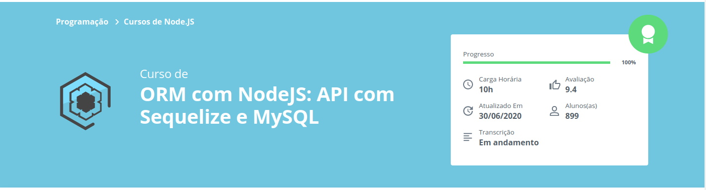

# Node + ORM(Sequelize)

Este repositório foi criado com o intuito de acompanhar e aplicar as técnicas aprendidas nos cursos da alura sobre **ORM Sequelize**

## Conhecimentos Adquiridos
- **ORM com NodeJS: API com Sequelize e MySQL**
    - Criação de uma API com NodeJS e algumas de suas principais bibliotecas
    - Aprendizado de como funciona um ORM na prática
    - Utilização do Sequelize para fazer operações em bancos sem usar SQL (diretamente)
    - Aplicação organizada no modelo MVC

## Cursos Implementados

[ORM com NodeJS: API com Sequelize e MySQL](https://cursos.alura.com.br/course/orm-nodejs-api-sequelize-mysql)
*(Clique [aqui](https://github.com/senaluisgf/orm-sequelize/releases/tag/orm_sequelize01) para baixar o código desenvolvido até esta etapa)*
